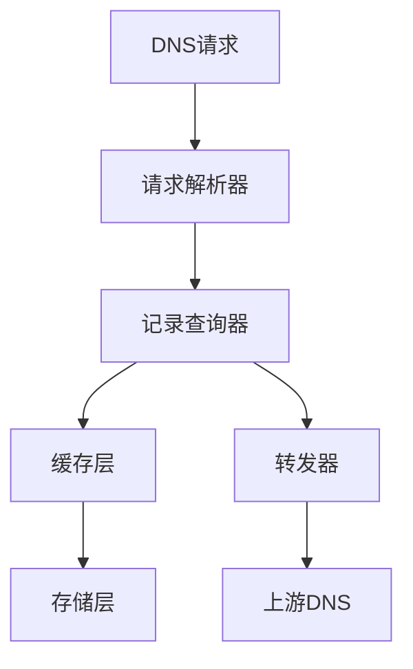
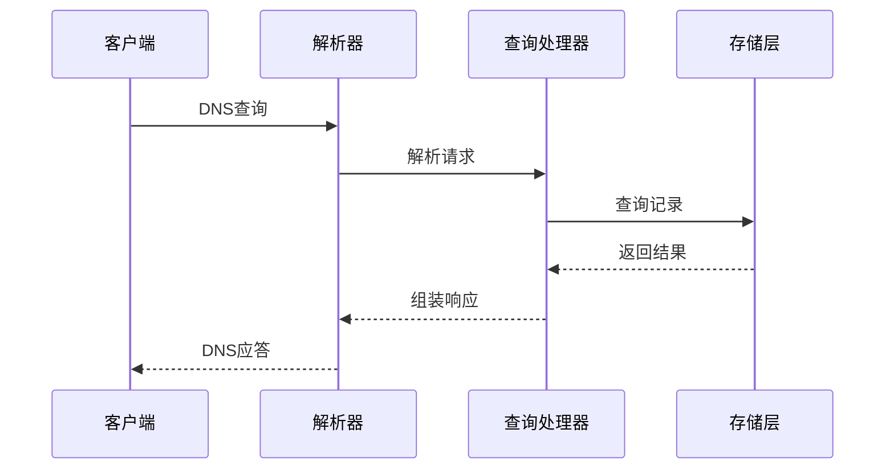

# DNS服务端

## 技术实现

DnsServerBundle 基于 RFC1035 规范实现了一个完整的 DNS 服务器。核心采用异步 I/O 处理 DNS 查询请求，支持 UDP/TCP 双协议。

## 架构设计

### 核心组件

- `DnsResolver`: DNS 报文解析器，处理 DNS 请求/响应的二进制格式转换
- `RecordManager`: 记录管理器，负责 DNS 记录的 CRUD 操作
- `CacheManager`: 缓存管理器，实现多级缓存策略
- `QueryProcessor`: 查询处理器，处理 DNS 查询的核心逻辑
- `Forwarder`: DNS 转发器，处理递归查询

## 扩展机制

Bundle 提供以下扩展点：

1. 自定义记录解析器（实现 `RecordResolverInterface`）
2. 缓存策略扩展（实现 `CacheStrategyInterface`）
3. 查询拦截器（实现 `QueryInterceptorInterface`）

## 技术限制

1. 内存限制：缓存条目数默认限制为 10000 条
2. 性能考虑：
   - 单实例每秒查询处理能力：约 5000 QPS
   - 缓存命中率低于 80% 时建议扩容
   - 不支持 DNSSEC

## 依赖关系

- 核心依赖：
  - `symfony/event-dispatcher`: 事件分发
  - `symfony/cache`: 缓存实现
  - `react/datagram`: UDP 协议支持
  - `react/socket`: TCP 协议支持

## 内部通信

## 性能优化

1. 采用 LRU 算法管理缓存
2. 使用内存映射文件存储大量 DNS 记录
3. 实现请求合并（Query Aggregation）减少上游查询
4. 异步 I/O 处理提升并发性能

## 注意事项

1. 需要 root 权限绑定 53 端口
2. 建议在容器环境中运行
3. 生产环境必须配置上游 DNS
4. 建议启用 systemd 监控服务状态

## 测试机制

### 单元测试

1. 测试范围
   - DNS 报文解析器（请求/响应格式转换）
   - 记录管理器（CRUD 操作验证）
   - 缓存管理器（缓存策略验证）
   - 查询处理器（查询逻辑验证）
   - 转发器（递归查询验证）

2. 测试工具
   - PHPUnit: 单元测试框架
   - Prophecy: 模拟对象框架
   - php-code-coverage: 代码覆盖率分析

### 集成测试

1. 组件交互测试
   - 完整 DNS 查询流程验证
   - 缓存系统与存储层交互
   - 事件分发机制验证

2. 性能测试
   - 并发查询压力测试
   - 缓存命中率统计
   - 响应时间监控
   - 资源占用分析

### 测试数据集

1. 标准测试数据
   - RFC1035 规范示例数据
   - 常见 DNS 记录类型
   - 异常格式数据

2. 性能测试数据
   - 大量域名查询样本
   - 多类型记录混合
   - 递归查询场景
